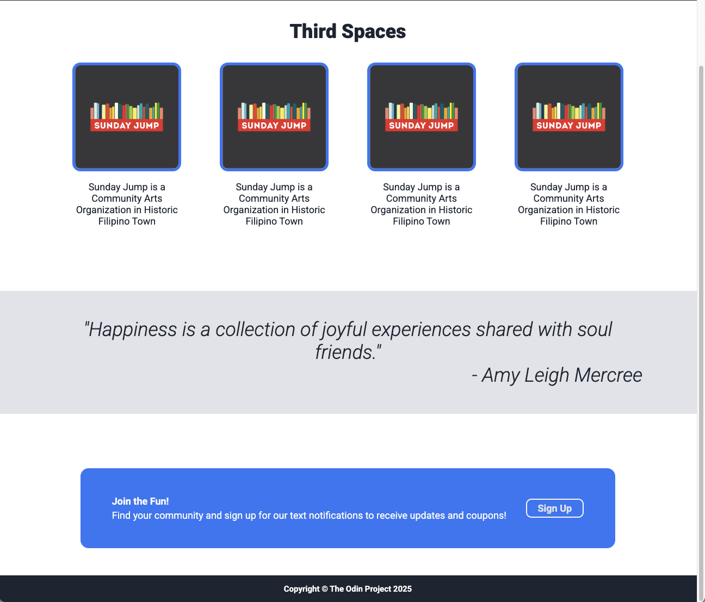
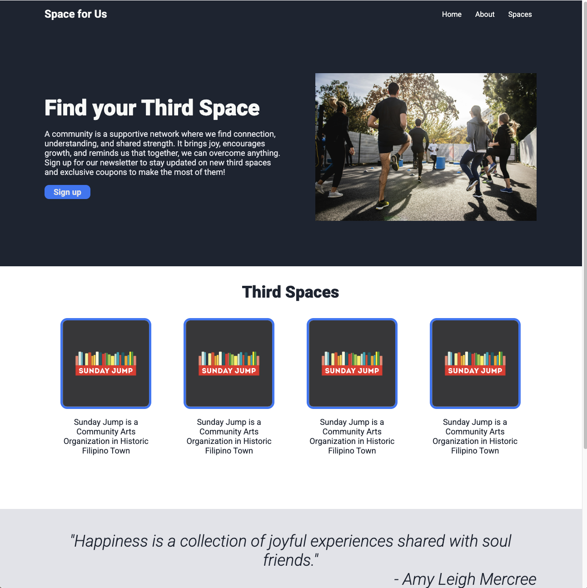

# top-landingpage

## Description

For this project, we focused on practicing our HTML and CSS skills by creating a complete web page from a provided design. The project came with two images: one showing the full layout of the website, and the other detailing the fonts and colors used. The goal wasn’t to create a pixel-perfect replica but to closely follow the design and understand how to position elements properly using HTML and CSS. We were encouraged to explore solutions online and experiment with personalizing the content, colors, and fonts, making the page our own while practicing key web development concepts. 

    1. Create a complete web page from the provided design using HTML and CSS.
    2. Position elements properly using HTML and CSS, ensuring they align with the design, but don’t worry about pixel-perfect accuracy.
    3. Use online resources like Google or previous lessons to search for solutions to challenges or unfamiliar CSS properties.
    4. Focus on practicing and refining your HTML and CSS skills rather than perfecting the smallest design details.

This project is important because it provides hands-on experience in translating a design into a functional web page, which is a core skill for web development. By working with HTML and CSS, we practice structuring content, styling elements, and ensuring they are properly positioned—essential skills for creating responsive and visually appealing websites. The project encourages problem-solving, resourcefulness, and creativity, while reinforcing the importance of following design specifications and adapting to challenges, all of which are critical in real-world web development scenarios.

## Final Product - [Space for Us](https://margoosh.github.io/top-landingpage/)

